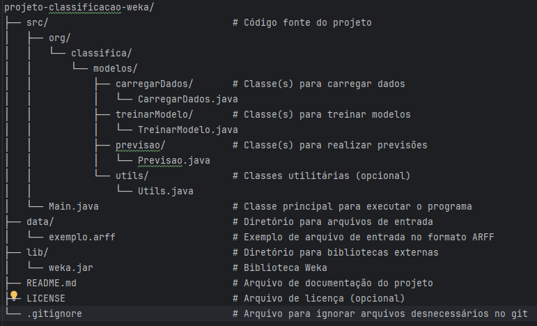

# 🌟 Projeto de Classificação com Weka 🌟
Este projeto foi desenvolvido como parte de um **trabalho de faculdade** com o objetivo de explorar conceitos de **aprendizado de máquina**, utilizando a biblioteca **Weka** em Java. Ele inclui as etapas principais de **carregamento de dados**, **treinamento de modelos** e **previsão**. 🧠✨

O foco do projeto é apresentar, de forma prática, como implementar um fluxo básico de aprendizado de máquina com **Java e Weka**, aplicando técnicas de classificação em conjuntos de dados no formato `.arff`.


---

## 🗂️ Estrutura do Projeto

O projeto segue a seguinte organização:


---

## 🚀 Recursos Utilizados

- **Java SDK**: Versão 24+ ☕
- **Biblioteca Weka**: Ferramenta poderosa para aprendizado de máquina 📊
- **Formato de Dados Suportado**: `.arff` 📄

---

### 🔧 Configuração Inicial

1. Baixe e adicione a biblioteca Weka ao projeto.
2. Certifique-se de que os arquivos `.arff` estão disponíveis no diretório correto.

---

## ⚙️ Instalação e Configuração

### 📋 Pré-requisitos

1. **Java 24+**: Certifique-se de ter o Java na versão adequada.
2. **Biblioteca Weka**: Inclua as dependecias arquivo `pom.xml` do Weka no seu projeto caso esteja utilizando o `Maven`.
3. **IDE (opcional)**: Recomendamos o uso de **IntelliJ IDEA**. 💻

### 🛠️ Dependência do Weka no `pom.xml`

Seu `pom.xml` precisa ter a dependência do Weka corretamente declarada. Aqui está um exemplo:

```xml
<dependency>
    <groupId>nz.ac.waikato.cms.weka</groupId>
    <artifactId>weka-stable</artifactId>
    <version>3.8.6</version> <!-- ou a versão que você estiver usando -->
</dependency>
```

### 🌀 Clonar o Repositório

Use o seguinte comando para clonar o projeto:

```bash
# Clone o repositório
git clone https://github.com/Felip3monteiro/AprendizadoMaquina.git

# Acesse a pasta do projeto
cd AprendizadoMaquina

# Compile o projeto
mvn compile

# Execute a classe principal (substitua pelo nome da sua classe principal)
mvn exec:java -Dexec.mainClass="org.classifica.Main"
````

---

## 🛠️ Como Utilizar

### 1️⃣ **Carregando os Dados**
Utilize a classe `carregarDados` para carregar arquivos `.arff`:


### 2️⃣ **Treinando o Modelo**
A classe `TreinarModelo` permite treinar um modelo de árvore de decisão **J48** facilmente:


### 3️⃣ **Realizando Previsões**
A classe `Previsao` pode ser usada para classificar novas instâncias:


---

## 🌟 Funcionalidades

✅ **Carregamento de Dados**:
Carregue arquivos `.arff` com facilidade.

✅ **Treinamento de Modelos**:
Treine modelos usando a árvore de decisão **J48**.

✅ **Previsão**:
Realize previsões para novas instâncias baseadas em modelos treinados.

---

## 📦 Dependências

- **[Weka](https://www.cs.waikato.ac.nz/ml/weka/)**: Biblioteca utilizada para aprendizado de máquina. 📘

---


## 🤝 Contribuições

Contribuições são sempre bem-vindas! 💡🤗  
Sinta-se à vontade para abrir **Issues** ou enviar **Pull Requests**.

---

## 📧 Contato

Dúvidas, sugestões ou ideias? Entre em contato:  
📩 [felipesilveiramonteiro@gmail.com](felipesilveiramonteiro@gmail.com)

---
